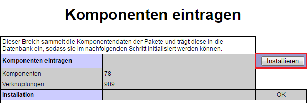
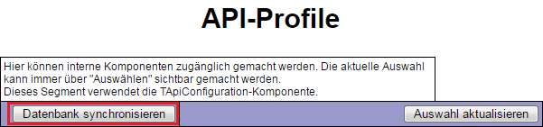

# Aufgabendatenbank - Erweiterung des Installationsassistenten von OSTEPU

Die Installation der Aufgabendatenbank erfolgt über die Einbindung in den Installationsassistenten von OSTEPU.

*A: Paket installieren*

Für die Anbindung an OSTEPU wird zunächst das Paket der Aufgabendatenbank in der Paketauswahl selektiert (Abbildung A) und damit die Erweiterung des Installationsassistenten vorgenommen. Nun enthält dieser neue Bereiche wie den in Abbildung C.

*B: die Aufgabendatenbank als Komponente installieren*

Die Komponenteninstallation muss erneut ausgeführt werden (Abbildung B)

*C: die Aufgabendatenbank konfigurieren*

Damit die Aufgabendatenbank auf die Komponenten von OSTEPU zugreifen kann, muss der Zugang konfiguriert werden. Dabei wird der Aufgabendatenbank mittels einer HTTP-Authentifizierung der Zugang ermöglicht. Das Passwort muss dazu wie in Abbildung C festgelegt werden bei der Aufgabendatenbank hinterlegt werden.

*D: die Aufgabendatenbank mit OSTEPU verbinden*

Die neue Komponente kann nun mit dem restlichen System verbunden werden, indem entsprechend Abbildung D die Verbindungen von SQaLibur zu OSTEPU und umgekehrt initialisiert werden. Zusätzlich richten wir darüber die externen Zugänge für SQaLibur ein, diese beziehen sich auf das neue CGate.

> E: die Zugänge für die Aufgabendatenbank installieren

Damit CGate später auch unsere Anfragen korrekt weiterleiten kann, werden die Zugangsdefinitionen der Aufgabendatenbank noch mit der Datenbank von OSTEPU synchronisiert. Damit kann die Aufgabendatenbank nun auch HTTP authentifizierte Anfragen an OSTEPU stellen.
